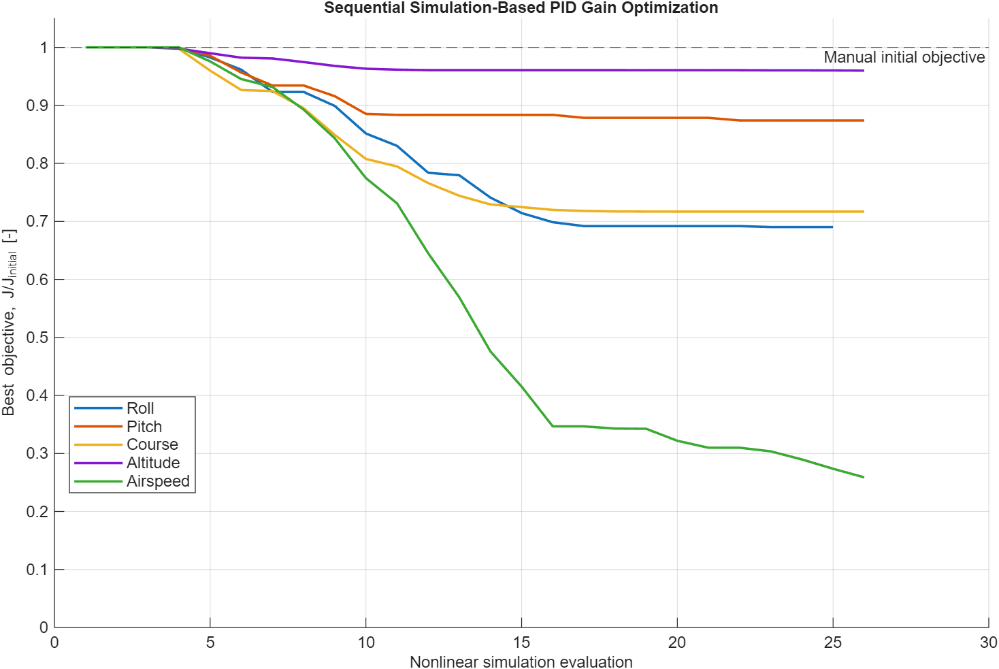
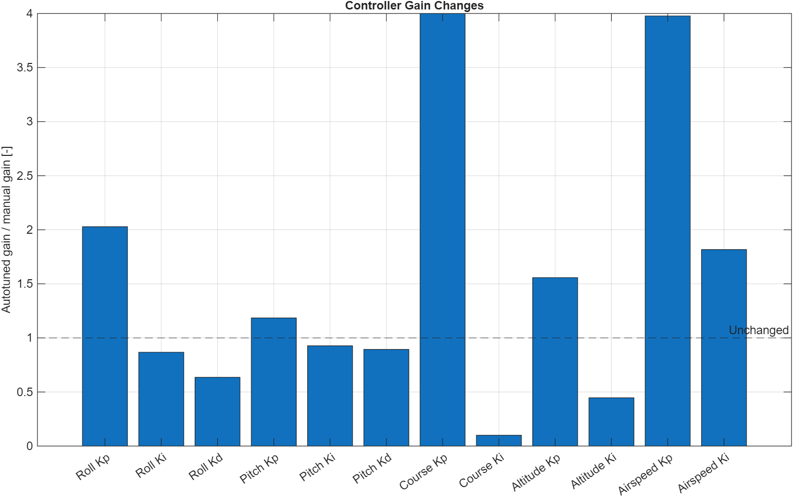
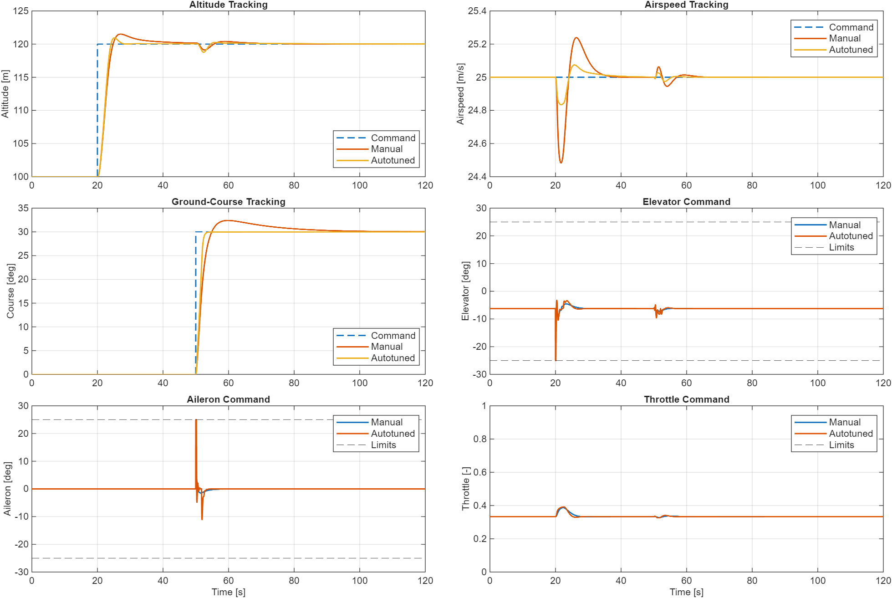
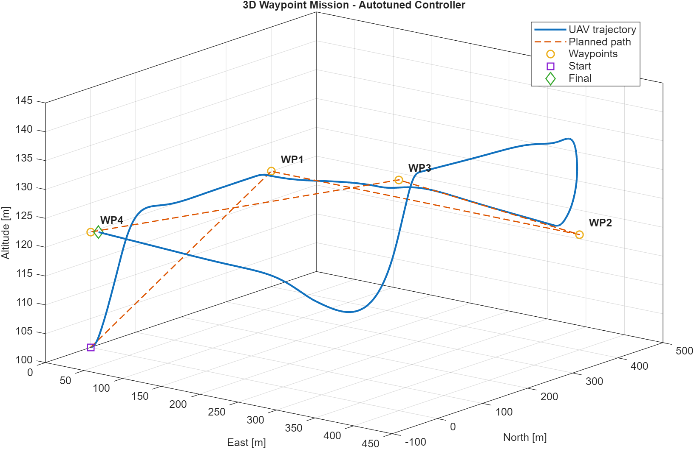
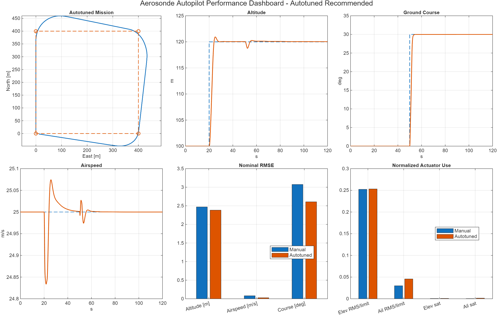

# Cascaded PID Autopilot for an Aerosonde Fixed-Wing UAV

## Overview

This GitHub-ready MATLAB/Simulink project implements, tunes, and validates a classical successive-loop-closure autopilot on a nonlinear 12-state, six-degree-of-freedom Aerosonde model. The controller holds airspeed and altitude, tracks ground course, and flies a four-waypoint mission while respecting attitude, surface, and throttle limits.

The original manually tuned controller remains the permanent baseline. A bounded, simulation-based numerical optimization then tunes the roll, pitch, course, altitude, and airspeed loops sequentially. Both profiles are independently exercised on the unchanged nonlinear plant in nominal, steady-wind, and waypoint scenarios. The full run reported here was executed with MATLAB R2025a and Simulink R2025a; every table, figure, CSV, MAT file, and video is generated from those simulations.

The complete Simulink model is generated programmatically by [`build_model.m`](build_model.m). Aircraft physics, controller equations, optimization logic, scoring, and plotting remain readable in ordinary MATLAB files.

## System Architecture

```text
Waypoint / Scenario Guidance
          |
          +--> Course PI --> bank command --> Roll PI-D --> aileron
          |
          +--> Altitude PI --> pitch command --> Pitch PI-D --> elevator
          |
          +--> Airspeed PI -------------------------------> throttle
                                      |
                                      v
                              Actuator Limits
                                      |
                                      v
                         Nonlinear 6-DOF Aerosonde
                                      |
                                      v
                    State / Wind-Relative Air-Data
                                      |
                                      +--------- feedback
```

The roll and pitch loops are faster than the course and altitude loops. This bandwidth separation lets the outer loops request feasible attitudes while the inner loops stabilize them. Roll and pitch use body rates `p` and `q` for damping instead of numerical differentiation. All controllers have deterministic reset behavior and conditional-integration anti-windup.

## Aircraft and Simulink Model

The state uses NED position and body-fixed velocity/attitude variables:

```matlab
x = [pn; pe; pd; u; v; w; phi; theta; psi; p; q; r];
h = -pd;
delta = [delta_e; delta_a; delta_r; delta_t];
```

[`plant/aircraft_dynamics.m`](plant/aircraft_dynamics.m) implements the translational and rotational rigid-body equations

```matlab
v_dot     = F/m - cross(omega,v)
omega_dot = I \ (M - cross(omega,I*omega))
```

with full `Jxz` inertia coupling, 3-2-1 Euler kinematics, and a body-to-NED direction-cosine matrix. [`plant/forces_moments.m`](plant/forces_moments.m) includes nonlinear lift blending, induced drag, side force, aerodynamic moments, gravity, and a static body-X propeller model. Wind is transformed from NED to body axes and subtracted before computing true airspeed, angle of attack, and sideslip. Ground course `chi` is calculated from NED ground velocity and is distinct from yaw/heading `psi`.

`UAV_Autopilot.slx` contains visible subsystems for commands/guidance, lateral and longitudinal control, actuator limits, nonlinear dynamics, and state/air-data calculations. The full validation model uses fixed-step fourth-order Runge-Kutta (`ode4`) at 0.01 s. The project requires MATLAB and Simulink only; it does not require Aerospace Blockset, Optimization Toolbox, Simulink Design Optimization, or Control System Toolbox.

> The aerodynamic data are a commonly published textbook/reference Aerosonde parameter set, not an identified digital twin of a particular airframe. No aerodynamic coefficient, mass/inertia value, propulsion parameter, hard limit, wind input, or waypoint was changed to improve the tuning result.

## Trim and Hard Limits

`build_model.m` solves straight-and-level trim once with base-MATLAB `fminsearch` and reuses it throughout tuning and validation.

| Quantity | Computed value |
|---|---:|
| Airspeed | 25.0000 m/s |
| Angle of attack | 4.7166 deg |
| Pitch angle | 4.7166 deg |
| Elevator | -6.2638 deg |
| Throttle | 0.3335 |
| Acceleration residual norm | `1.212e-9` |

The unchanged limits are:

- elevator, aileron, and rudder: +/-25 deg
- throttle: `[0, 1]`
- commanded bank: +/-35 deg
- commanded pitch: +/-20 deg

## Automatic PID Gain Optimization

The manual gains were first established using successive-loop closure. The optimizer preserves that engineering structure and solves five small problems in this order:

```text
manual baseline
  -> tune roll
  -> retain roll and tune pitch
  -> retain roll/pitch and tune course
  -> retain roll/pitch/course and tune altitude
  -> retain four loops and tune airspeed
  -> validate one candidate gain set in all full scenarios
```

Each problem uses base-MATLAB `fminsearch` with a bounded logistic transformation. The bounds are positive and referenced to the manual gains: `Kp` and `Kd` use 0.25x to 4x, while `Ki` uses 0.10x to 5x. Thus the unconstrained search variable cannot create negative or extreme controller gains.

The objective is dimensionless and tracking-dominant, but it also penalizes final error, control effort, time near actuator saturation, overshoot/excessive attitude, and unstable flight. Solver failures, non-finite states, unreasonable altitude/airspeed, excessive attitude, or prolonged saturation receive a large rejection cost rather than terminating the search. Dedicated 25-40 s tuning maneuvers reduce runtime; the model and trim are prepared once and reused, and Fast Restart is used as an acceleration rather than a project dependency.

The executed engineering budget was 14 iterations and 24 nominal function evaluations per loop (`TolX = TolFun = 1e-3`). The history records every candidate, function evaluation, cost, and best-so-far value in [`results/tuning_history.mat`](results/tuning_history.mat). The course solution reached its imposed bounds (`Kp = 4x`, `Ki = 0.1x`); that fact is retained visibly rather than being hidden by wider post-hoc limits.

**This is a simulation-based numerical gain optimization procedure and is not MathWorks PID Autotuner.**

### Manual and optimized gains

The manual values remain immutable under `P.control.manual.*`. [`tuning/apply_gain_profile.m`](tuning/apply_gain_profile.m) copies either `manual` or `autotuned` gains into the backward-compatible active fields read by the existing controller functions. The accepted optimized values are also stored in human-readable [`tuning/autotuned_gains.m`](tuning/autotuned_gains.m).

| Loop | Gain | Manual | Auto-tuned | Ratio |
|---|---|---:|---:|---:|
| Roll | Kp | 1.050000 | 2.129695 | 2.028 |
| Roll | Ki | 0.120000 | 0.104101 | 0.868 |
| Roll | Kd | 0.180000 | 0.114411 | 0.636 |
| Pitch | Kp | 1.650000 | 1.954733 | 1.185 |
| Pitch | Ki | 0.100000 | 0.092732 | 0.927 |
| Pitch | Kd | 0.280000 | 0.250274 | 0.894 |
| Course | Kp | 1.200000 | 4.800000 | 4.000 |
| Course | Ki | 0.080000 | 0.008000 | 0.100 |
| Altitude | Kp | 0.020000 | 0.031148 | 1.557 |
| Altitude | Ki | 0.001500 | 0.000669 | 0.446 |
| Airspeed | Kp | 0.070000 | 0.278409 | 3.977 |
| Airspeed | Ki | 0.025000 | 0.045422 | 1.817 |

| Tuned loop | Initial cost | Final cost | Reduction |
|---|---:|---:|---:|
| Roll | 0.214401 | 0.147995 | 30.97% |
| Pitch | 0.130566 | 0.114122 | 12.59% |
| Course | 1.484059 | 1.063894 | 28.31% |
| Altitude | 0.810478 | 0.778023 | 4.00% |
| Airspeed | 0.062270 | 0.016118 | 74.12% |





## Full Nonlinear Validation

The unchanged full scenarios are:

1. **Nominal, 120 s:** 100 to 120 m altitude at 20 s; 0 to 30 deg course at 50 s; 25 m/s airspeed.
2. **Steady wind, 120 s:** the same commands and gains with `wind_ned = [5; 3; 0]` m/s.
3. **Waypoint mission, 66 s:** `(N,E,h) = (400,0,120)`, `(400,400,120)`, `(0,400,140)`, and `(0,0,120)` m with the unchanged 40 m capture radius.

The same optimized gain set is used in all three cases; there is no retuning for wind or waypoint flight. RMSE excludes only the first 5 s, and course error is angle-wrapped.

### Nominal tracking and effort

Positive improvement means the auto-tuned value is lower. Negative entries disclose degradations.

| Metric | Manual | Auto-tuned | Improvement |
|---|---:|---:|---:|
| Altitude RMSE [m] | 2.470 | 2.383 | +3.51% |
| Airspeed RMSE [m/s] | 0.0802 | 0.0275 | +65.76% |
| Course RMSE [deg] | 3.075 | 2.607 | +15.21% |
| Elevator RMS [deg] | 6.308 | 6.328 | -0.32% |
| Aileron RMS [deg] | 0.750 | 1.141 | -52.21% |
| Elevator saturation [% samples] | 0.058 | 0.083 | -42.86% |
| Aileron saturation [% samples] | 0.042 | 0.142 | -240.00% |

The optimized controller improves all three nominal tracking metrics, but uses more aileron RMS effort and has more brief surface saturation. Both profiles still reach exactly 25 deg peak surface deflection during transients; the saturation fractions show that the limit contact is short rather than sustained. These degradations are included in the acceptance score.



### Wind and waypoint validation

| Metric | Manual | Auto-tuned | Improvement |
|---|---:|---:|---:|
| Wind altitude RMSE [m] | 2.472 | 2.385 | +3.50% |
| Wind airspeed RMSE [m/s] | 0.0803 | 0.0275 | +65.76% |
| Wind course RMSE [deg] | 3.353 | 2.822 | +15.84% |
| Waypoints reached | 4 / 4 | 4 / 4 | unchanged |
| Final waypoint error [m] | 13.249 | 11.463 | +13.48% |
| Waypoint max roll [deg] | 36.728 | 38.428 | -4.63% |
| Waypoint max pitch [deg] | 19.869 | 20.787 | -4.62% |

The transparent weighted validation score improved from 2.5496 to 2.3136 (9.26%). The candidate remained finite, respected every hard actuator limit, passed the original nominal and wind thresholds, reached 4/4 waypoints, and stayed within the explicit saturation safeguard. It is therefore marked **AUTOTUNING RESULT: ACCEPTED**. This is simulation evidence, not a formal robust-control or flight-safety guarantee.





The standard final-profile figures are also retained:

- [2D waypoint trajectory](results/trajectory.png)
- [Altitude tracking](results/altitude_tracking.png)
- [Airspeed tracking](results/airspeed_tracking.png)
- [Course tracking](results/heading_tracking.png)
- [Control inputs with hard-limit lines](results/control_inputs.png)

The [Aerosonde flight animation](results/aerosonde_flight.mp4) uses actual waypoint position, airspeed, course, and 3-2-1 Euler attitude. A body-frame fixed-wing glyph is transformed with the same body-to-NED convention as the plant, displayed as East/North/positive altitude, sampled at 20 video frames/s, and played at 5x simulated time.

## Reproduce the Project

Open MATLAB in the repository root. The scripts add project paths and create `results/` automatically.

### Standard project validation

This rebuilds the model and runs the accepted auto-tuned profile when `autotuned_gains.m` is generated and accepted; otherwise it safely falls back to the manual profile. It does not retune.

```matlab
build_model
run('simulation/run_all.m')
```

### Complete automatic tuning workflow

This establishes a fresh manual baseline, runs the five sequential optimizations, validates both profiles in all six full cases, evaluates acceptance, writes tables/history, and regenerates every visualization and the animation.

```matlab
run('tuning/autotune_all.m')
```

### Manual versus auto-tuned comparison only

```matlab
run('simulation/run_comparison.m')
```

### Regenerate the flight animation only

```matlab
[P,trim] = build_model(false);
[waypointData,~,P] = simulate_case('waypoint','autotuned',false,P,trim);
animate_flight(waypointData,P,5);
```

Command-line examples:

```text
matlab -batch "run('simulation/run_all.m')"
matlab -batch "run('tuning/autotune_all.m')"
matlab -batch "run('simulation/run_comparison.m')"
```

## Repository Structure

```text
UAV-Cascaded-PID-Autopilot/
|-- README.md
|-- build_model.m
|-- UAV_Autopilot.slx
|-- parameters/aircraft_parameters.m
|-- plant/                       nonlinear dynamics and air data
|-- control/                     five unchanged PI/PI-D implementations
|-- guidance/                    validation, tuning, and waypoint commands
|-- tuning/
|   |-- autotune_all.m
|   |-- tune_roll.m, tune_pitch.m, tune_course.m
|   |-- tune_altitude.m, tune_airspeed.m
|   |-- optimize_loop.m, tuning_cost.m, simulate_tuning_case.m
|   |-- apply_gain_profile.m, autotuned_gains.m
|   `-- export_tuning_results.m, save_autotuned_gains.m
|-- simulation/
|   |-- simulate_case.m, run_nominal.m, run_wind_case.m
|   |-- run_waypoint_case.m, run_all.m, run_comparison.m
|   `-- run_profile_cases.m, run_comparison_profiles.m
|-- analysis/
|   |-- extract_results.m, compute_metrics.m, plot_results.m
|   `-- print_validation_summary.m, evaluate_autotuning.m
|-- visualization/
|   |-- plot_comparison.m, plot_3d_trajectory.m
|   `-- plot_tuning_convergence.m, animate_flight.m
|-- results/
|   |-- tuning_history.mat, comparison_results.mat
|   |-- gain_comparison.csv, tuning_summary.csv
|   |-- manual_vs_autotuned_metrics.csv
|   |-- seven PNG result/comparison/dashboard figures
|   `-- aerosonde_flight.mp4
```

## Engineering Rationale

- **Why cascaded control?** Attitude stabilization needs greater bandwidth than navigation and energy loops.
- **Why sequential tuning?** It preserves successive-loop closure, reuses already tuned inner loops, and avoids an opaque 12-variable search.
- **Why not minimize tracking alone?** An aggressive controller can buy lower RMSE by spending excessive time at actuator limits.
- **Why nonlinear simulation?** The final plant includes nonlinear aerodynamics, coupled motion, hard limits, and wind effects absent from a small linear approximation.
- **Why preserve manual gains?** They provide a transparent baseline and make the optimizer prove that its tradeoff is useful.
- **Why test unchanged gains in wind?** It evaluates off-nominal disturbance response without falsely claiming formal robustness.

## Limitations

- Feedback uses true simulated states; there is no sensor model, state estimator, noise, or sensor fusion.
- The propeller is a static thrust approximation without motor, battery, or propeller dynamics.
- Aerodynamics use a textbook/reference coefficient set rather than airframe identification or flight-test data.
- The environment is flat-Earth, constant-density NED; Euler attitude retains a protected +/-90 deg pitch singularity.
- Rudder is fixed at zero, so there is no coordinated-turn or sideslip loop.
- The direct-to-waypoint guidance deliberately remains unchanged; finite-radius corner overshoot is guidance behavior, not hidden by tuning.
- The optimized course gains lie on the chosen search bounds and merit broader robustness/Monte Carlo study before real-flight use.
- All acceptance evidence is deterministic software simulation. Hardware-in-the-loop, sensor/actuator dynamics, uncertainty sweeps, and flight testing remain future work.

## References

- R. W. Beard and T. W. McLain, *Small Unmanned Aircraft: Theory and Practice*, Princeton University Press, 2012.
- BYU MAGICC, MAVSim Aerosonde reference model and publicly published parameter set.
- `jpaine126/uavbook_mavsim`, public educational implementation associated with small-UAV flight dynamics.
- MathWorks documentation for programmatic Simulink model construction, `fminsearch`, `VideoWriter`, and fixed-step solvers.

The implementation was written independently from standard rigid-body and textbook aerodynamic equations; no completed external autopilot repository was copied.
